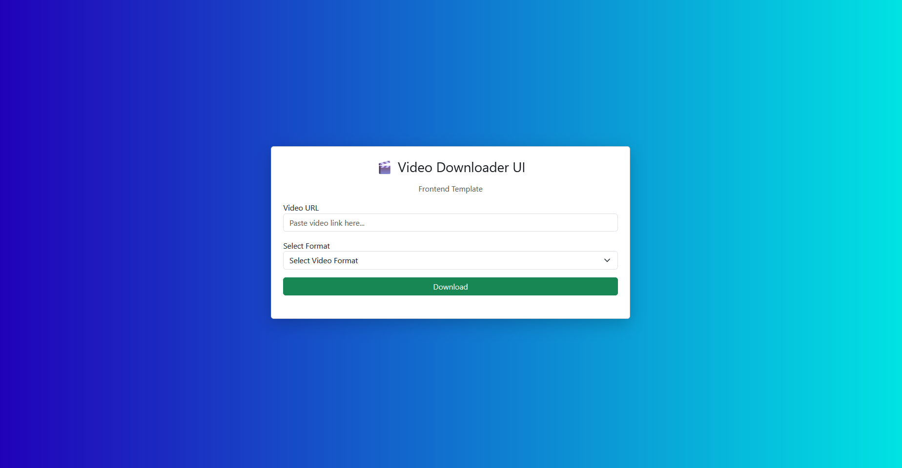

# 🎬 Video Downloader UI Template

A clean, modern, and responsive **frontend UI template** for a video downloader application.
Built using **HTML, CSS, and Bootstrap**, this project focuses on user-friendly design and smooth interaction, making it ready for backend integration.

---

## 🧱 Project Structure

```bash
video-downloader-ui-template/
│
├── assets/           # Images / icons
├── index.html        # Main UI structure
├── styles.css        # Custom styling
├── app.js            # UI interaction logic
├── LICENSE 
└── README.md         # Project documentation
```

---


## ✨ Features

### 🎯 Clean & Minimal UI

* Simple and intuitive layout
* Focused on usability and accessibility
* Beginner-friendly structure

---

### 📱 Responsive Design

* Fully responsive across devices
* Works smoothly on desktop, tablet, and mobile
* Built using Bootstrap grid system

---

### ⚡ Interactive Form Handling

* Input validation for video URL
* Format selection dropdown
* Dynamic UI feedback for user actions

---

### 🔌 Backend Ready

* Designed for easy integration with APIs or backend services
* Can be connected to Node.js, Python, or any video processing service

---

## 🛠 Technologies Used

| Technology               | Role              |
| ------------------------ | ----------------- |
| **HTML5**                | Structure         |
| **CSS3**                 | Styling           |
| **Bootstrap 5**          | Responsive layout |
| **JavaScript (Vanilla)** | Interactivity     |

---

## ▶️ How to Use

### 1️⃣ Clone the Repository

```bash
git clone https://github.com/ShakalBhau0001/video-downloader-ui-template.git
cd video-downloader-ui-template
```

### 2️⃣ Open the Project

Simply open:

```bash
index.html
```

in any modern browser.

---

## ⚠️ Disclaimer

> This project is a **frontend UI template only**.
> It does **NOT include any video downloading functionality**.
> Intended for **educational and UI development purposes**.

---

## 🚀 Future Improvements

* Add dark mode 🌙
* Add loading animations ⏳
* Integrate backend API 🔗
* Add drag & drop URL input 🎯
* Convert into React version ⚛️

---

## 🎯 Purpose of This Project

This project is built to:
* Practice **frontend UI development**
* Build **clean and responsive layouts**
* Create **backend-ready interfaces**
* Enhance **portfolio projects**

---

## 📸 Preview



---

## 🪪 Author

> **Creator: Shakal Bhau**

> **GitHub: [ShakalBhau0001](https://github.com/ShakalBhau0001)**

---

## ⭐ Support

If you like this project, consider giving it a ⭐ on GitHub!

---
